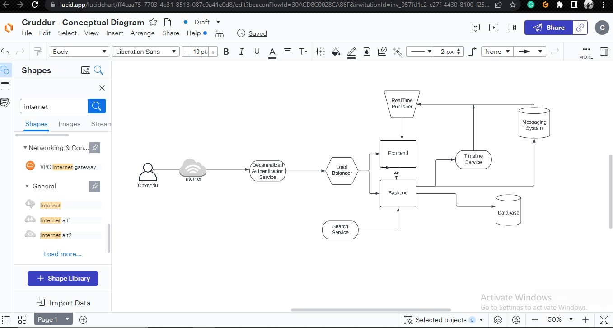
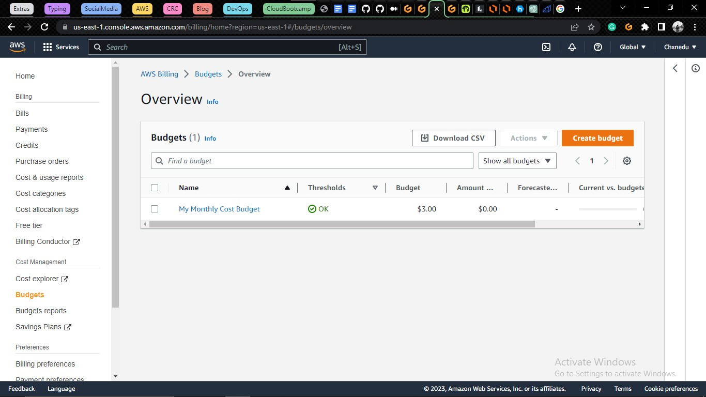
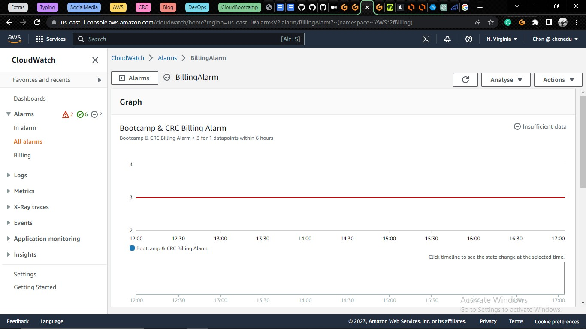

# Week 0 — Billing and Architecture

## Required Homework
- ### Conceptual Diagram  

[Link to view](https://lucid.app/lucidchart/ff4caa75-7703-4e31-8518-087c0a41e0d8/edit?viewport_loc=-706%2C-194%2C2220%2C1114%2C0_0&invitationId=inv_057fd1c2-c27f-4430-8100-f251736d69c5)

- ### Create a Budget
I created a budget of $3 using the AWS Console, as that's the amount I'm willing to get to before getting notified

- ### Create a Billing Alarm
I created a billing alarm with a threshold of $3 using the AWS Console.

- ### Install AWS CLI
I installed the AWS CLI on my Gitpod environment manually, and updated the gitpod config file to install it automatically each time I launch a new environment

- ### Logical Diagram

[Link to view](https://lucid.app/lucidchart/8f290f23-099f-4c6d-8a82-d44e0b928ad0/edit?viewport_loc=-128%2C108%2C2220%2C1114%2C0_0&invitationId=inv_1505932e-e749-471c-98a1-51785e646532)

