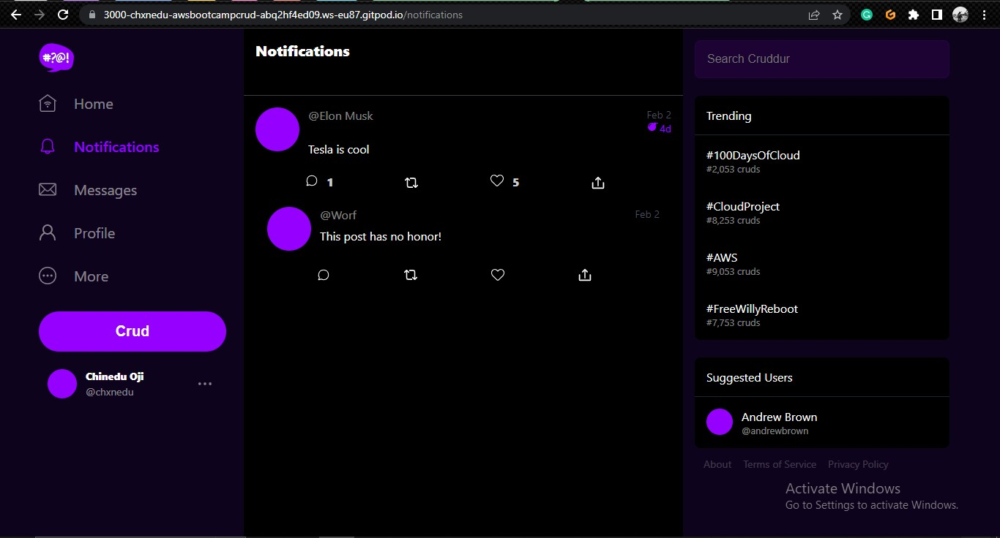
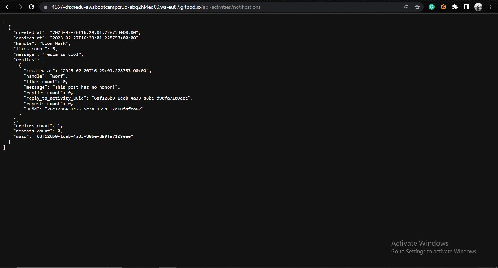
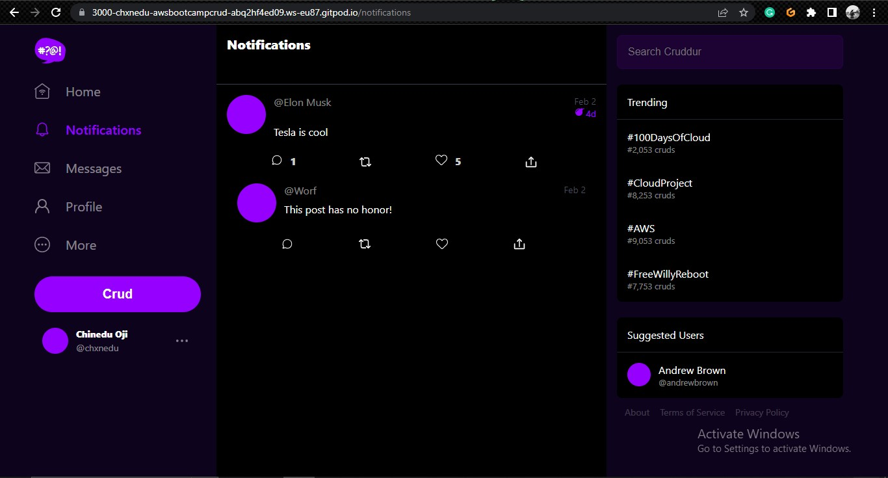
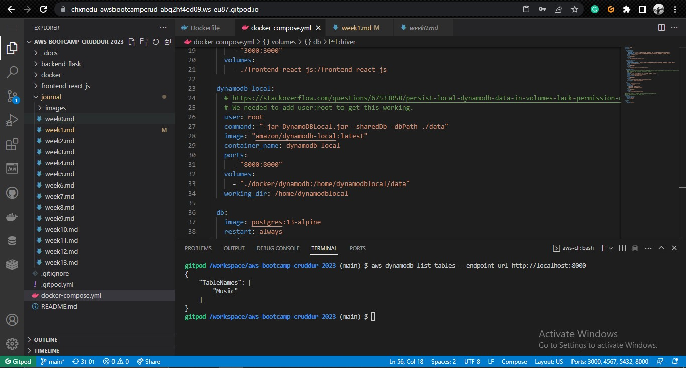
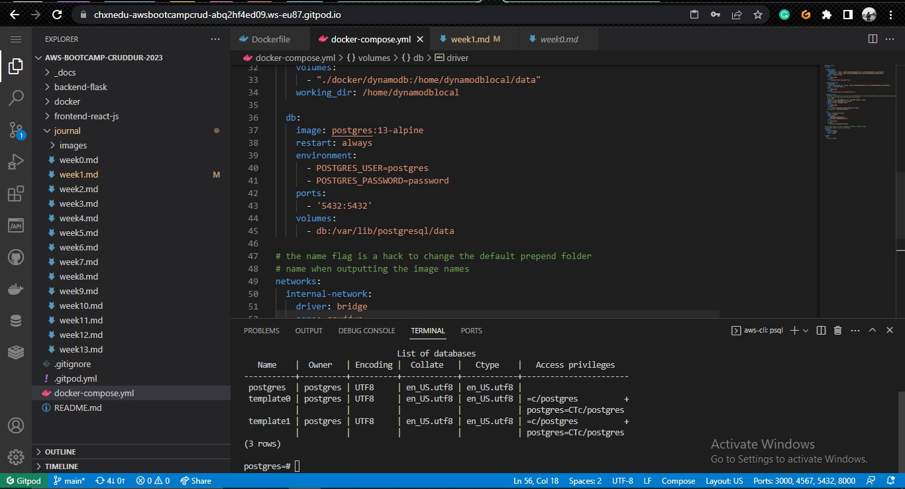
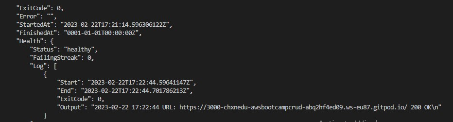
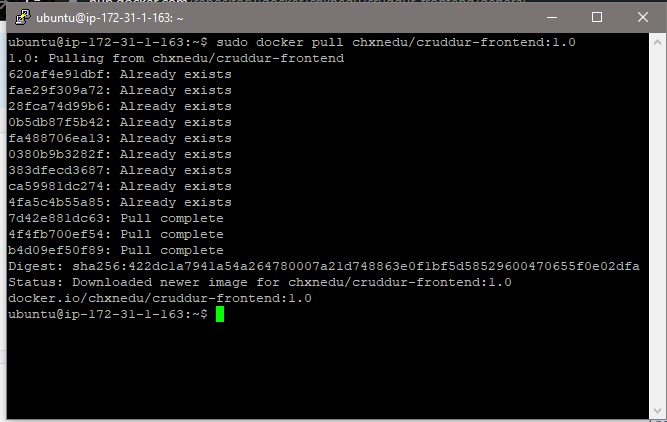
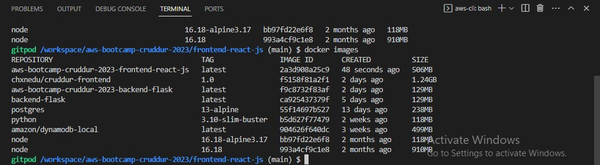

# Week 1 — App Containerization

## Required Homework
- ### Containerizing the Application
I was able to containerize the application with Docker, and it ran successfully.

[Frontend Dockerfile](https://github.com/Chxnedu/aws-bootcamp-cruddur-2023/blob/main/frontend-react-js/Dockerfile)
[Backend Dockerfile](https://github.com/Chxnedu/aws-bootcamp-cruddur-2023/blob/main/backend-flask/Dockerfile)
[Docker Compose File](https://github.com/Chxnedu/aws-bootcamp-cruddur-2023/blob/main/docker-compose.yml)

- ### Documenting Notification Endpoint
I added the notification endpoint to my [OpenAPI File](https://github.com/Chxnedu/aws-bootcamp-cruddur-2023/blob/main/backend-flask/openapi-3.0.yml)

- ### Flask Backend Endpoint for Notifications
I wrote a flask backend endpoint for Notifications and confirmed that it worked

- ### React page for Notifications
I wrote a react page for notifications

- ### DynamoDB Local
I successfully ran a dynamodb local container

- ### Postgres Container
I successfully ran a postgres container

## Homework Challenges
- ### Pushing a tagged Image to Dockerhub
I tagged my frontend image as 1.0 and pushed it to Docker Hub. Here's a [Link](https://hub.docker.com/r/chxnedu/cruddur-frontend) to the image

- ### Implementing Healthchecks
I was able to implement a healthcheck for my frontend and backend conatainer in my [Docker Compose File](https://github.com/Chxnedu/aws-bootcamp-cruddur-2023/blob/main/docker-compose.yml)

- ### Running Docker on EC2
I launched an EC2 Instance, installed Docker on it, and was able to pull the frontend image I committed to Docker Hub earlier

- ### Using Multistage build for Dockerfile
I used a multistage build for my [Frontend Dockerfile](https://github.com/Chxnedu/aws-bootcamp-cruddur-2023/blob/main/frontend-react-js/Dockerfile) build and was able to reduce the file from 1.24gb to 500mb. I know it should be possible to reduce the file size more than that, but I don't really know how react works and what files are important to the application

From the picture above, the first image is the new image after the multistage build, and the second image is the original image that I pushed to Docker Hub.

